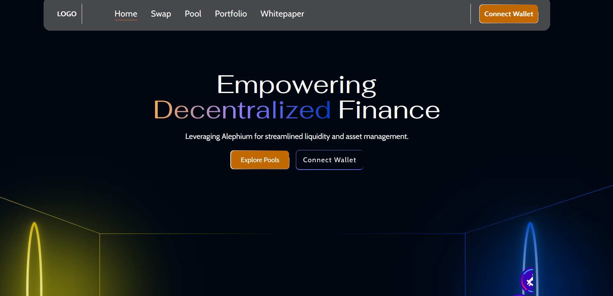
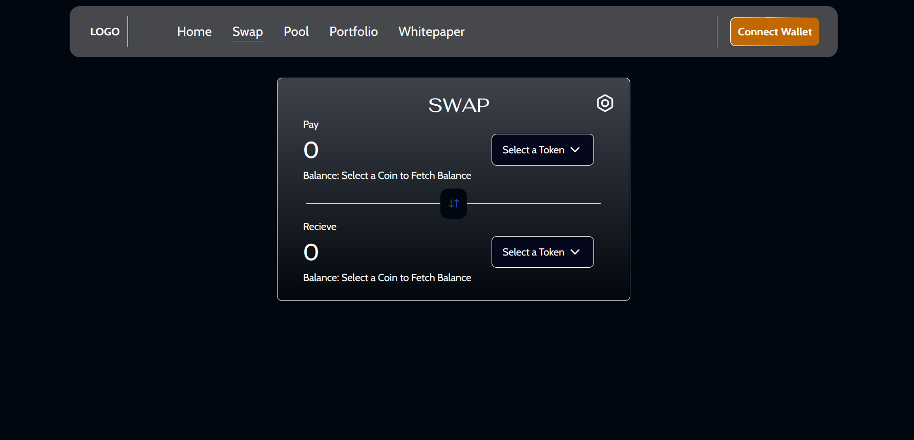

# Stable Swap

A stableswap is an automated market maker (AMM) focused on stablecoins swapping with minimal slippage and more efficient trading for liquidity providers.

## Problem Statement

Alephium lacks native DEXs, limiting DeFi potential and liquidity within its ecosystem. Existing DEX solutions on other blockchains suffer from high fees, slow transactions, and scalability issues, which can hinder mass adoption.
Alephium lacks a native platform for low-slippage swaps between stablecoins or pegged assets, which is crucial for fostering a vibrant DeFi ecosystem.

## Solution

Stable Swap DEX on Alephium
A Stable Swap DEX on Alephium optimized for low-slippage, high-efficiency trading between stablecoins and other closely correlated assets. Leveraging Alephium's scalable sharding architecture and energy-efficient consensus, this solution would offer:

- Low Slippage Trading: An AMM algorithm designed for stable assets, ensuring minimal price deviation.
- Efficient Liquidity Utilization: Enhanced liquidity pools for stablecoins, allowing for deeper liquidity and reduced risk for liquidity providers.
- Low Transaction Fees: Alephium’s low-cost and energy-efficient infrastructure, making swaps fast and affordable.

## What does UI/UX looks like ?




## How to Run Locally

1. **Clone the repository**:

   ```bash
   git clone https://github.com/rohanarora17/alephium-hackathon.git
   cd alephium-hackathon

   ```

2. **Install dependencies:**

```bash
npm install
```

3. **Set up environment variables:**

   - Rename env.example to .env.
   - Configure any necessary variables in the .env file.

4. **Start the development server:**

```bash
npm run dev
```
